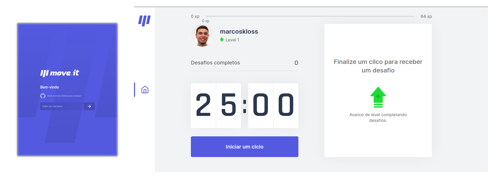

<h1 align="center">
  
</h1>

<p align="center">
  <a href="#-tecnologias">Tecnologias</a>&nbsp;&nbsp;&nbsp;|&nbsp;&nbsp;&nbsp;
  <a href="#-projeto">Projeto</a>
</p>


<br>

<p align="center">
  
</p>

## Teste a aplicação:
<a href="https://moveit-marcoskloss.vercel.app/">moveit-marcoskloss.vercel.app/</a>

## 🚀 Tecnologias

Tecnologias utilizadas:

- ReactJS
- Next.js
- CSS modules

## 💻 Projeto

Move.it é uma aplicação de controle de tempo no estilo pomodoro, onde o usuário encontra um ambiente gamificado com nívies e desafios após completar um ciclo. Desenvolvido durante a NLW 4 realizada pela Rocketseat.


## 🚀🔥 Milha Extra

Adicionei ao layout original responsividade para ser adaptável a diferentes tamanho de telas, além disso codifiquei a página de login que utiliza a API do Github para carregar a foto e o username do usuário.


---

#### 🛠️ Instale o projeto na sua máquina:

```bash

    # Clonar o repositório
    $ git clone https://github.com/filipeleonelbatista/dev-finances.git

    # Entrar no diretório
    $ cd moveit

    # Instalando as dependencias com Yarn
    $ yarn install
    # Executando a aplicação
    $ yarn dev
    
    # Instalando as dependencias com NPM
    $ npm install
    # Executando a aplicação
    $ npm run dev
```

---

<h3 align="center" >Conecte-se comigo! 😉</h3>
<p align="center">
  <a href="https://www.linkedin.com/in/marcos-kloss/">
    
  </a>&ensp;
</p>
